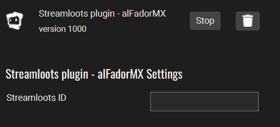
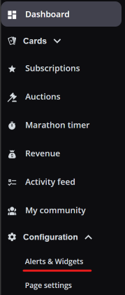
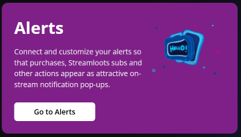
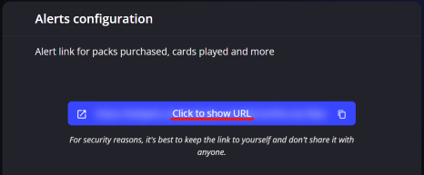
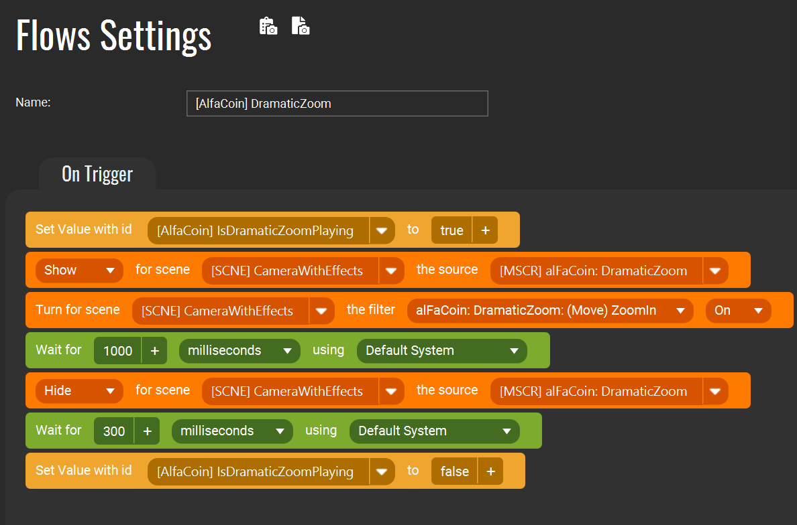
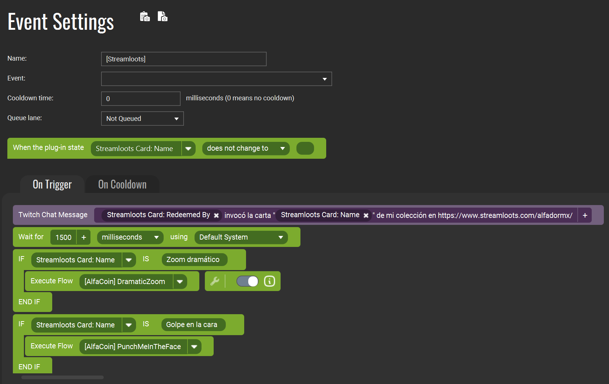

# TouchPortal Streamloots Plugin

React to Card claims from within [Touch Portal](https://www.touch-portal.com/) and trigger flows accordingly.

## Features

- **Settings:**
    - `Streamloots ID`              - Your Streamloots ID

- **States**
    - `Streamloots Chest: Purchased By`     - 
    - `Streamloots Chest: Gifted By`        - 
    - `Streamloots Chest: Quantity`         - 
    - `Streamloots Card: Name`              - 
    - `Streamloots Card: Image`             - 
    - `Streamloots Card: Description`       - 
    - `Streamloots Card: Redeemed By`       - 
    - `Streamloots Card: Alert Message`     - 
    - `Streamloots Card: Field (Message)`   - 


## Installation

As with all plugins, this requires the Touch Portal Pro version to function. Follow this [Import a Touch Portal plug-in (.tpp)](https://www.touch-portal.com/blog/post/tutorials/import-plugin-guide.php) tutorial.

To configure the plugin you need your Streamloots ID.



### How to get a Streamloots ID?
1. Log in into your Streamloots account then navigate to the **Configuration > Alerts & Widgets** page at the bottom part of the navigation menu.  

2. Click on the **Go to Alerts** button.  

3. Click on the **Click to show URL** button.  

4. The link should look like this:
    ```
    https://widgets.streamloots.com/alerts/your-very-long-id
    ```
    Copy the _your-very-ong-id_ part and paste it as your **Streamloots ID** in the Settings plugin page.

### How to react to a card event?
The optimal way to use this plugin is by integrating it with Touch Portal's Events and Flows. Here is an example:

1. **Set up a Flow**: In this example, I am creating a flow called **[AlfaCoin] Dramatic Zoom**. _Flows can be triggered by a Button press or, in our case, by a Plugin event._
    
2. Configure your event as follows:
    1. **Name**: Any name you choose for this Event.
    2. **Event**: **Values & States - When Plug-in State changes**.
    3. **Cooldown time**: As desired.
    4. **Queue lane**: As desired.
    5. **When the plug-in state**: Set it to _Streamloots Card: Name_ with the condition _does not change to_ and leave the value _empty (as shown in the image below)_.
    6. Finally, configure each card with an IF-Else statement. **Note**: The _Streamloots Card: Name_ value will be the name of the card as configured in Streamloots.
       


## Want to contribute?

First off, thanks for taking the time to contribute! ❤️. Read the guideliness and setup environment instructions in our [CONTRIBUTING](https://github.com/alfadormx/touchportal.plugin.streamloots/blob/main/CONTRIBUTING.md) document.

## Acknowledgements
- [TouchPortalPluginSDK](https://github.com/ChristopheCVB/TouchPortalPluginSDK)

## License

The content of this project itself is licensed under the [GPL-3.0 license](https://www.gnu.org/licenses/gpl-3.0.html).